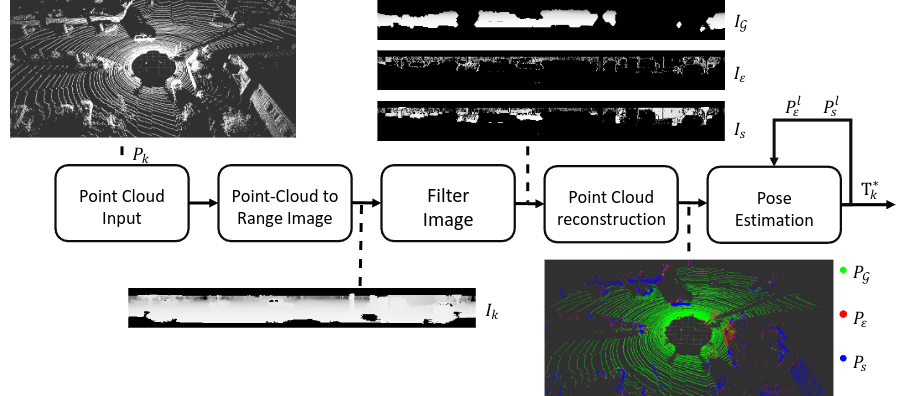
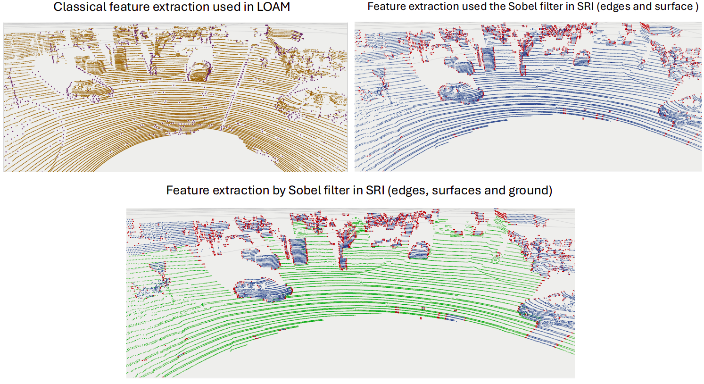

# LiLO: Lightweight and lowbias LiDAR Odometry method based on spherical range image filtering

This repository presents the code for replicating the whole pipeline presented in the works: [LiLO: Lightweight and lowbias LiDAR Odometry method based on spherical range image filtering](https://arxiv.org/abs/2311.07291)

**Note:** This node uses the dependencies of the [aurova_odom](https://github.com/AUROVA-LAB/aurova_odom/tree/main) and [aurova-preprocessed](https://github.com/AUROVA-LAB/aurova_preprocessed) metapackages.




<!---
Citations [[Preprint](https://arxiv.org/abs/2311.07291)]:
``` 
@article{velasco2023lilo,
  title={LiLO: Lightweight and low-bias LiDAR odometry method based on spherical range image filtering},
  author={Velasco-S{\'a}nchez, Edison P and Mu{\~n}oz-Ba{\~n}{\'o}n, Miguel {\'A}ngel and Candelas, Francisco A and Puente, Santiago T and Torres, Fernando},
  journal={arXiv preprint arXiv:2311.07291},
  year={2023}
}
```
-->

### Feature extraction process
This process is carried out using our feature extraction package, which is available in [aurova-preprocessed](https://github.com/AUROVA-LAB/aurova_preprocessed) and is called [pc_features](https://github.com/AUROVA-LAB/aurova_preprocessed/tree/master/pc_features).


### Feature extraction comparation 
The figure shows the feature extraction of the KITTI dataset in sequence 08, using the proposed method and comparing it with the classical feature extraction method tested in LOAM-based methods.




## Installation instructions to use

### Requirements to use application:

- System requirements: Ubuntu 20.04 and ROS Noetic.
- External libraries: [ceres-solver-2.0.0](http://ceres-solver.org/installation.html) (IMPORTANT!! [download](https://drive.google.com/file/d/1acZtn_jaHfj2BVgwaDnQH2Lz-7022F1-/view?usp=share_link) version 2.0.0). Eigen and PCL are usually installed join with ROS.
- External ROS packages: "sudo apt-get install ros-noetic-hector-\*".
- Local ROS packages: [aurova_preprocessed](https://github.com/AUROVA-LAB/aurova_preprocessed) and [aurova_odom](https://github.com/AUROVA-LAB/aurova_odom).

The [odom_estimation_pc](https://github.com/AUROVA-LAB/aurova_odom/tree/main/odom_estimation_pc) node estimates the pose by subscribing to the edge and surface topics published by the [pc_features](https://github.com/AUROVA-LAB/aurova_preprocessed/tree/master/pc_features) node, which filters these features from a point cloud generated by a LiDAR sensor.

### Point cloud feature extraction:


```shell
roslaunch roslaunch pc_feature_extraction ouster_image.launch
```

### Pose estimation:

```shell
roslaunch roslaunch odom_estimation_pc odomEstimation_ouster.launch
```

We use this LiDAR odometry method in:

Applications:
``` 
@article{munoz2024geolocalization,
          title={Geo-Localization Based on Dynamically Weighted Factor-Graph},
          author={Muñoz-Bañón, Miguel Ángel and Olivas, Alejandro and Velasco-Sánchez, Edison and Candelas, Francisco A. and Torres, Fernando},
          journal={IEEE Robotics and Automation Letters},
          volume={9},
          number={6},
          pages={5599--5606},
          year={2024},
          doi={10.1109/LRA.2024.3396055},
          publisher={IEEE}
        }

@article{munoz2022openstreetmap,
          title={Openstreetmap-based autonomous navigation with lidar naive-valley-path obstacle avoidance},
          author={Muñoz-Bañón, Miguel Ángel and Velasco-Sánchez, Edison and Candelas, Francisco A. and Torres, Fernando},
          journal={IEEE Transactions on Intelligent Transportation Systems},
          volume={23},
          number={12},
          pages={24428--24438},
          year={2022},
          doi={10.1109/TITS.2022.3208829},
          publisher={IEEE}
        }
```