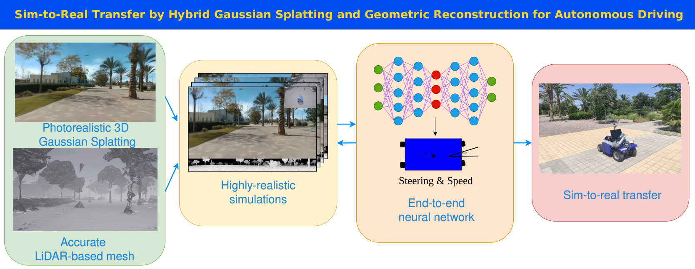

# Overview

This repository contains resources and instructions for setting up the framework presented in [Sim-to-Real Transfer by Hybrid 3D Gaussian Splatting and LiDAR Reconstruction for Autonomous Driving](https://aurova-projects.github.io/Sim2Real/).

## Video

[](https://www.youtube.com/embed/QmRLwfY-0To?si=J6UgT5NGmGmXUAz0)


## Installation

System requirements: Ubuntu 20.04 and ROS Noetic.

1. Follow the instructions outlined in [CARLA's documentation](https://carla.readthedocs.io/en/latest/build_linux/) to install Unreal Engine and CARLA. IMPORTANT: when cloning the repository, clone our [fork](https://github.com/Aleoli2/carla):
    ```
    git clone https://github.com/Aleoli2/carla.git
    ```
2. Install the CARLA ROS bridge following [ROS Bridge Installation](https://carla.readthedocs.io/projects/ros-bridge/en/latest/ros_installation_ros1/) by using the source repository, but for step 2 use our [fork](https://github.com/Aleoli2/ros-bridge):
    ```
    git clone --recurse-submodules https://github.com/Aleoli2/ros-bridge.git catkin_ws/src/
    ```
3. Install the python CARLA library: 
    ```
    cd <path/to/carla>/PythonAPI/carla/dist/
    pip install <carla_wheel>.whl
    ```
    Add the source path for the ROS bridge workspace. `source /path/to/catkin_ws/devel/setup.bash`. To add it permanently:
    ```
    echo "source /path/to/catkin_ws/devel/setp.bash" >> ~/.bashrc
    ```
4. Installation of AUROVA planning and localization (skip this step if you want only to use the end-to-end local planner, although you must edit some files).
    - External libraries: [ceres-solver-2.0.0](http://ceres-solver.org/installation.html) (IMPORTANT!! [download](https://drive.google.com/file/d/1acZtn_jaHfj2BVgwaDnQH2Lz-7022F1-/view?usp=share_link) version 2.0.0). Eigen and PCL are usually installed join with ROS.
    - Local libraries: [lib_localization](https://github.com/AUROVA-LAB/lib_localization) and [lib_planning](https://github.com/AUROVA-LAB/lib_planning).
    - Clone the ROS packages at `catkin_ws/src/` and build them with `catkin_make`.
        - External ROS packages: [iri_base_algorithm](https://gitlab.iri.upc.edu/labrobotica/ros/iri_core/iri_base_algorithm), "sudo apt-get install ros-noetic-ackermann-\*", "sudo apt-get install ros-noetic-robot-state-\*", "sudo apt-get install ros-noetic-hector-\*".
        - Local ROS packages: [applications](https://github.com/AUROVA-LAB/applications), [aurova_preprocessed](https://github.com/AUROVA-LAB/aurova_preprocessed), [aurova_odom](https://github.com/AUROVA-LAB/aurova_odom),  [aurova_localization](https://github.com/AUROVA-LAB/aurova_localization), and [aurova_planning](https://github.com/AUROVA-LAB/aurova_planning).
5. Follow the instructions of [aurova/reconstruction/hybrid_3dgs_mesh](https://github.com/AUROVA-LAB/aurova_reconstruction/tree/master/hybrid_3dgs_mesh) to build the simulated environments from real-world data.
6. Install the [Sim2Real_local_planner](https://github.com/AUROVA-LAB/aurova_planning/tree/master/Sim2Real_local_planner).

## Usage

### CARLA Simulator Launch

1. Launch CARLA Simulator by running `CarlaUE4.sh`.
2. If you have followed the instructions of [aurova/reconstruction/hybrid_3dgs_mesh](https://github.com/AUROVA-LAB/aurova_reconstruction/tree/master/hybrid_3dgs_mesh), you should create a new map and add there the meshes. Place them at Z=0, and save the position in X and Y as the offset_GS of each scene in  `scripts/configGS.py` Unreal Engine shows the distances in cm, they should be converted to m.
3. Once loaded, click `Play` and wait for the simulation to start.
4. Optionally, launch the project for faster execution and to avoid loading the editor each time. The application should be saved in `.../carla/Unreal/CarlaUE4/Saved/StagedBuilds/LinuxNoEditor/`, and inside this folder edit `CarlaUE4/Config/DefaultEngine.ini` to change the initial map.

### Dataset generation

The bash scripts [dataset_generation.sh](./scripts/dataset_generation.sh), manage CARLA to spawn the vehicle, launching the ROS agent, performing the different routes of a scene and save the dataset. Follow the instructions of the bash script [dataset_generation.sh](./scripts/dataset_generation.sh) and set your appropiate variables.   This script launch the expert agent and save the 360 RGB-D images obtained from LiDAR data, the camera transformations to generate the RGB images, the desired Ackermann state and other measurements (goal coordinates, robot's pose...).

<details>
  <summary>Add new scene</summary>

  ---

  There are several steps to add a new scene and define the routes. Firstly, edit `scripts/configGS.py` to add the paths to the camera_models (output of COLMAP/GLOMAP) and to the 3DGS model. Then, you should define the position of the nodes and the trajectories in `routes/ScientificPark.xml` (or if you use the name of your world, replace ScientificPark by your name in all the files). With the Unreal Engine Editor you can see the coordinates by adding an empty object and place it where the node will be, just remember to transform the coordinates from cm to meters. While running the CARLA simulator (either with *play* in the editor or with the deployed application), obtain the GNSS coordinates of those nodes:

  ```
  python map2OpenStreet.py -m ScientificPark.xml
  ```

  Move the file `ScientificPark.osm` to `paths` folder, or just copy the new nodes. It is used to build a graph of the environment, so the ways should contain the information about the edges between nodes. It doesn't need all the routes, be sure that when a node is connected with other, just they appear successively in one way. 

  In `dataset_generation.sh` add the route's ids in way_id_train and way_id_val, and it is also needed to add the routes in close_loop_train and close_loop_val [aurova_planning](https://github.com/AUROVA-LAB/aurova_planning). Edit similary the `test_execution.py` file.

  ---
</details>

- Generate the dataset 
```
roscd app_Sim2Real/scripts
./dataset_generation.sh
```

- Generate the RGB images using the generated 3DGS models. To generate them with Octree-GS, run:

```
docker run --rm --gpus all --ipc=host --ulimit memlock=-1 --ulimit stack=67108864 -it --net=host --privileged -e DISPLAY=$DISPLAY -v /tmp/.X11-unix:/tmp/.X11-unix:rw -v /dev:/dev -v PATH/TO/applications/app_Sim2Real/:/app_Sim2Real -v PATH/TO/aurova_reconstruction/hybrid_3dgs_mesh/:/workspace -v PATH/TO/DATASET:/dataset -v PATH/TO/3DGS/DATASET/:/workspace/data --cpuset-cpus 0-3 --name aurova_octreeGS aurova_octree_gs

cd /app_Sim2Real/scripts/
python generate_Gaussian_Splatting_images.py --scene NAME_SCENE --model_GS octreeGS
```

Repeat the last instruction for each scene. PATH/TO/DATASET indicates the path of the dataset for autonomous navigation, while PATH/TO/3DGS/DATASET/ is the one generated with [aurova/reconstruction/hybrid_3dgs_mesh](https://github.com/AUROVA-LAB/aurova_reconstruction/tree/master/hybrid_3dgs_mesh), where the COLMAP/GLOMAP results are, as the camera model is load from those files. To generate with Gaussian Opacity Fields or Hierarchical-3DGS, launch the respective Docker image and change the `--model_GS` argument.

- The structure of the obtained dataset is the following one:
```
dataset/
├── train
│   ├── scene1_session1/
|   |   ├── commands.csv
│   │   ├── lidar
│   │   │   ├── 1.png
│   │   │   ├── 2.png
│   │   │   ├── ...
|   |   ├── measurements.csv
|   |   ├── rgb_images_octreeGS
│   │   │   ├── 1.png
│   │   │   ├── 2.png
│   │   │   ├── ...
│   │   ├── safety_matrices.txt
│   ├── scene1_session2/
|   |   ├── commands.csv
│   │   ├── lidar
│   │   │   ├── 1.png
│   │   │   ├── 2.png
│   │   │   ├── ...
|   |   ├── ...
|   ├── ...
├── val
|   ├── ...
...
```

 
- To generate the `safety_matrices.txt` files, run:

```
cd PATH/TO/CATKIN_WS/src/aurova_planning/Sim2Real_local_planner/process_data/build
./calculate_safety_actions PATH/TO/DATASET
```

## Training
For training the end-to-end neural network, run the Docker image:
```
docker run --gpus all --rm -it --shm-size=500gb --ulimit memlock=-1 --ulimit stack=67108864 -v PATH/TO/CATKIN_WS/aurova_planning/Sim2Real_local_planner/:/Sim2Real -v PATH/TO/DATASET/:/dataset --name aurova_sim2real aurova_sim2real
```

Configure the `config.py` file to select the training scenes (adding *scene1* to the list, the network will be trained with all the folders that start with *scene1*) and set your `rgb_images` folder. Then, start the training:

```
cd Sim2Real/
python train.py --id EXPERIMENT_NAME --save_k 3 --num_workers 12 --batch_size 8 --model safety
```

## Usage
### Real robot
For using the end-to-end neural network in our UGV, BLUE, write the path of the trained model in `aurova_planning/Sim2Real_local_planner/agent_ros.launch` and run the Docker image of [Sim2Real_local_planner](https://github.com/AUROVA-LAB/aurova_planning/tree/master/Sim2Real_local_planner) for ROS. In other terminal, launch the rest of the nodes:

```
roslaunch Sim2Real_local_planner nav_network_GeoLoc_online.launch
```

Wait until the vehicle is localized and send "2D Nav Goal" from rviz to start autonomous navigation. The followed route is defined in `params/nav_network_GeoLoc_online.yaml`. In other terminal run the docker for ground boundaries detection (whole localization pipeline), as explained [here](https://github.com/AUROVA-LAB/aurova_detections/tree/main/yolinov2_ros). For evaluation, save in a rosbag the /localization and /CLEAR_status topics. In our work, we get the ground truth trajectory using the NVP local planner, which is the expert for our models.

### Simulation
For rendering the 3DGS images while using CARLA simulator, firstly build the docker images for CARLA simulator, which are inside `docker` folder. For Octree-GS:

```
cd docker
docker build --build-arg USER_ID=$(id -u) --build-arg GROUP_ID=$(id -g) -t aurova_carla:octree_gs --build-arg USER_ID=$(id -u) --build-arg GROUP_ID=$(id -g)
```

Run the Docker image of [Sim2Real_local_planner](https://github.com/AUROVA-LAB/aurova_planning/tree/master/Sim2Real_local_planner):
```
docker run --gpus all --rm -it --shm-size=500gb --ulimit memlock=-1 --ulimit stack=67108864 -v PATH/TO/CATKIN_WS/aurova_planning/Sim2Real_local_planner/:/Sim2Real --name aurova_sim2real aurova_sim2real

cd Sim2Real
python agent.py --model_path PATH/TO/MODEL
```

In other terminal, run the CARLA Docker image sharing the necesary folders:
```
docker run --rm --gpus all --ipc=host --ulimit memlock=-1 --ulimit stack=67108864 -it --net=host --privileged -e DISPLAY=$DISPLAY -v /tmp/.X11-unix:/tmp/.X11-unix:rw -v /dev:/dev -v PATH/TO/applications/app_Sim2Real/:/app_Sim2Real -v PATH/TO/aurova_preprocessed/reconstruction_3dgs_mesh/:/workspace -v PATH/TO/3DGS/DATASET/:/workspace/data --cpuset-cpus 0-3 --name aurova_carla_octreeGS aurova_carla:octree_gs

cd /app_Sim2Real/scripts
./test_execution.sh
```
With a joystick, it can be simulated emergency stops and local minimums, the program will save also that information.

To save the ground truth trajectory in simulation using NVP as ground truth, edit the architecture in `test_execution.sh` and run it outside the Docker. Save a rosbag of the trajectory.

## Evaluation
The trajectories are evaluated with the script `trajectory_evaluation.py`, comparing them with the ground truth trajectory.  This script calculates the Dynamic Wrapping Time (DWT) between both trajectories to measure their similarity, the time ratio between ground truth and the evaluated trajectory, and the number of interventions made by the human operator.

#### Utils

There are several Python scripts in [scripts](./scripts) folder:

- `manual_control_joystick.py`: Spawns robot BLUE, controlled by a joystick. Should be executed inside the CARLA Docker to render the 3DGS images.
- `joystick_keymap.py`: Displays current joystick key mapping. Modify global variables in Python scripts to configure controls.
- `record_rosbag_data.py`: Used to get the dataset from trajectories performed with tthe real robot.
- `compress_rosbag.py`: Reduces the rosbag size discarting the images and LiDAR data.
- `crop_rosbag.py`: Crop a rosbag, used to evaluate each lap of the long test routes.

