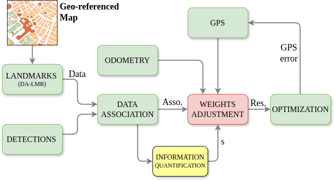

# Geo-Localization
This repository presents the code for replicating the whole pipeline presented in the work: [Geo-Localization Based on Dynamically Weighted Factor-Graph](https://aurova-projects.github.io/geo-localization_weighted/)



## Installation instructions to replicate

### Requirements to use application:

- System requirements: Ubuntu 20.04 and ROS Noetic.
- External libraries: [ceres-solver-2.0.0](http://ceres-solver.org/installation.html) (IMPORTANT!! [download](https://drive.google.com/file/d/1acZtn_jaHfj2BVgwaDnQH2Lz-7022F1-/view?usp=share_link) version 2.0.0). Eigen and PCL are usually installed join with ROS.
- Local libraries: [lib_localization](https://github.com/AUROVA-LAB/lib_localization).
- External ROS packages: [iri_base_algorithm](https://gitlab.iri.upc.edu/labrobotica/ros/iri_core/iri_base_algorithm), "sudo apt-get install ros-noetic-ackermann-\*", "sudo apt-get install ros-noetic-robot-state-\*", "sudo apt-get install ros-noetic-hector-\*".
- Local ROS packages: [robot_blue](https://github.com/AUROVA-LAB/robot_blue), [aurova_preprocessed](https://github.com/AUROVA-LAB/aurova_preprocessed), [aurova_odom](https://github.com/AUROVA-LAB/aurova_odom), [aurova_detections](https://github.com/AUROVA-LAB/aurova_localization), and [aurova_localization](https://github.com/AUROVA-LAB/aurova_detections).

### Steps to use application (offline mode via rosbag):

- [Download](https://drive.google.com/file/d/1oW7MLIJhvlNtgJsetXNRY-BQxufgPUoJ/view?usp=sharing) bag file for this example.
- Modify "launch/nav_GeoLoc_offline.launch" to provide correct link in "bag_file_1" argument.
- Modify "params/nav_GeoLoc_offline.yaml" to provide correct link in "url_to_map" variable.
- Run next command for localization (Odometry + GPS):

```shell
roslaunch app_geo_localization nav_GeoLoc_offline.launch
```
- Follow the instructions [here](https://github.com/AUROVA-LAB/aurova_detections/tree/main/yolinov2_ros) to run the docker for ground boundaries detection (whole localization pipeline):

### Steps to use application: (online mode via BLUE robot)

- Modify "params/nav_GeoLoc_online.yaml" to provide correct link in "url_to_map" variable.
- Run next command for localization:

```shell
roslaunch app_geo_localization nav_GeoLoc_online.launch
```
- Drive!!

Citation:
``` 
@article{munoz2024geoloc,
  author={Muñoz-Bañón, Miguel Ángel and Olivas, Alejandro and Velasco-Sánchez, Edison and Candelas, Francisco A. and Torres, Fernando},
  journal={IEEE Robotics and Automation Letters}, 
  title={Geo-Localization Based on Dynamically Weighted Factor-Graph}, 
  year={2024},
  volume={9},
  number={6},
  pages={5599-5606},
  doi={10.1109/LRA.2024.3396055}}
```
