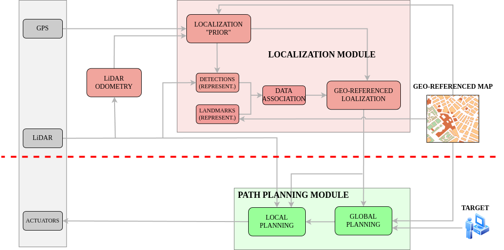

# Geo-Navigation
This repository presents the code for replicating the whole pipeline presented in the works: [Geo-Localization Based on Dynamically Weighted Factor-Graph](https://aurova-projects.github.io/geo-localization_weighted/) + [OpenStreetMap-Based Autonomous Navigation With LiDAR Naive-Valley-Path Obstacle Avoidance](https://aurova-projects.github.io/osm_path_planning/) 



Citations:
``` 
@article{munoz2024geolocalization,
          title={Geo-Localization Based on Dynamically Weighted Factor-Graph},
          author={Muñoz-Bañón, Miguel Ángel and Olivas, Alejandro and Velasco-Sánchez, Edison and Candelas, Francisco A. and Torres, Fernando},
          journal={IEEE Robotics and Automation Letters},
          volume={9},
          number={6},
          pages={5599--5606},
          year={2024},
          doi={10.1109/LRA.2024.3396055},
          publisher={IEEE}
        }

@article{munoz2022openstreetmap,
          title={Openstreetmap-based autonomous navigation with lidar naive-valley-path obstacle avoidance},
          author={Muñoz-Bañón, Miguel Ángel and Velasco-Sánchez, Edison and Candelas, Francisco A. and Torres, Fernando},
          journal={IEEE Transactions on Intelligent Transportation Systems},
          volume={23},
          number={12},
          pages={24428--24438},
          year={2022},
          doi={10.1109/TITS.2022.3208829},
          publisher={IEEE}
        }
```

## Installation instructions to replicate

### Requirements to use application:

- System requirements: Ubuntu 20.04 and ROS Noetic.
- External libraries: [ceres-solver-2.0.0](http://ceres-solver.org/installation.html) (IMPORTANT!! [download](https://drive.google.com/file/d/1acZtn_jaHfj2BVgwaDnQH2Lz-7022F1-/view?usp=share_link) version 2.0.0). Eigen and PCL are usually installed join with ROS.
- Local libraries: [lib_localization](https://github.com/AUROVA-LAB/lib_localization) and [lib_planning](https://github.com/AUROVA-LAB/lib_planning).
- External ROS packages: [iri_base_algorithm](https://gitlab.iri.upc.edu/labrobotica/ros/iri_core/iri_base_algorithm), "sudo apt-get install ros-noetic-ackermann-\*", "sudo apt-get install ros-noetic-robot-state-\*", "sudo apt-get install ros-noetic-hector-\*".
- Local ROS packages: [robot_blue](https://github.com/AUROVA-LAB/robot_blue), [aurova_preprocessed](https://github.com/AUROVA-LAB/aurova_preprocessed), [aurova_odom](https://github.com/AUROVA-LAB/aurova_odom), [aurova_detections](https://github.com/AUROVA-LAB/aurova_localization), [aurova_localization](https://github.com/AUROVA-LAB/aurova_detections), and [aurova_planning](https://github.com/AUROVA-LAB/aurova_planning).

### Steps to use application (offline mode via rosbag):

- [Download](https://drive.google.com/file/d/1oW7MLIJhvlNtgJsetXNRY-BQxufgPUoJ/view?usp=sharing) bag file for this example.
- Modify "launch/nav_NVP_GeoLoc_offline.launch" to provide correct link in "bag_file_1" argument.
- Modify "params/nav_NVP_GeoLoc_offline.yaml" to provide correct link in "geo_localization:url_to_map" variable and "global_planning:url_path" variable.
- Run next command for localization (Odometry + GPS) + NVP:

```shell
roslaunch app_geo_navigation nav_NVP_GeoLoc_offline.launch
```
- Follow the instructions [here](https://github.com/AUROVA-LAB/aurova_detections/tree/main/yolinov2_ros) (in the example section) to run the docker for ground boundaries detection (whole localization pipeline).
- Wait until the vehicle is localized.
- For autonomous navigation send "2D Nav Goal" from rviz.

### Steps to use application (online mode via BLUE robot):

- Modify "params/nav_NVP_GeoLoc_online.yaml" to provide correct link in "geo_localization:url_to_map" variable and "global_planning:url_path" variable.
- Run next command for localization (Odometry + GPS) + NVP:

```shell
roslaunch app_geo_navigation nav_NVP_GeoLoc_online.launch
```
- Follow the instructions [here](https://github.com/AUROVA-LAB/aurova_detections/tree/main/yolinov2_ros) (in the example section) to run the docker for ground boundaries detection (whole localization pipeline).
- Drive until the vehicle is localized.
- For autonomous navigation send "2D Nav Goal" from rviz.